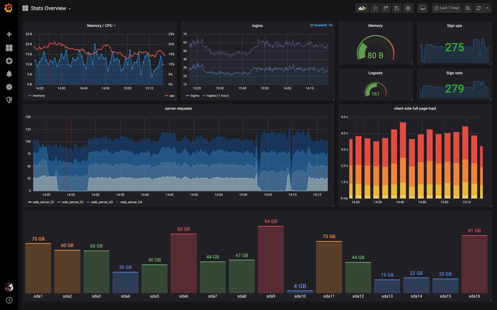

class: middle, center

# How much do you lift? - 101 of load testing.

Aleksander Lisiecki

.right[AlekLisiecki @ Twitter]
.right[aleklisi @ GitHub]
.right[aleksander.lisiecki@erlang-solutions.com]

---
# How much do you lift?

.scale80[]

---
# What is performance?

Performance is an ability of a system to work under certain load.

---
# Disclaimer 1

.scale60[]

---
# Disclaimer 2

.scale60[]

---
# Do I have a performance problem?

.scale80[]

---
# Do I have a performance problem?

.scale80[]

---
# Agenda

.scale80[]

---
# ...well **enough**

.scale80[]

---
# How to determine of a service is good **enough**?

Monitoring - observe and check the progress or quality of (something) over a period of time; keep under systematic review.

Metric - a system or standard of measurement.

---
# Metric reporting

Pushing:
 - Graphene
 - InfluxDB

Pulling:
 - Prometheus

---
# Pulling vs pushing

.scale80[]

---
# Data visualization - Grafana

.scale80[]

---
# Load testing

.scale80[]

---

.scale80[]

---
# Where to improve?
.scale60[]

---
# Flame graph
.scale100[]

---
# How to compare not obvious metics samples?

- Unpaired two-samples t-test (compare the mean of two independent groups).*
- Unpaired two-samples Wilcoxon test (used when your data are not normally distributed).

*Note that, unpaired two-samples t-test can be used only under certain conditions:
 - when the two groups of samples (A and B), being compared, are normally distributed. This can be checked using Shapiro-Wilk test.
 - and when the variances of the two groups are equal. This can be checked using F-test.

---
# Scaling application

- Horizontal
- Vertical

.scale100[]

---
# Vertical scaling
.scale100[]

---
# Horizontal scaling
.scale100[]

---
# Cache
.scale100[]

---
class: middle, center
# System components upgrade

---
# If everything else fails,...
.scale100[]

---
class: middle, center
# Thank you for your attention!
